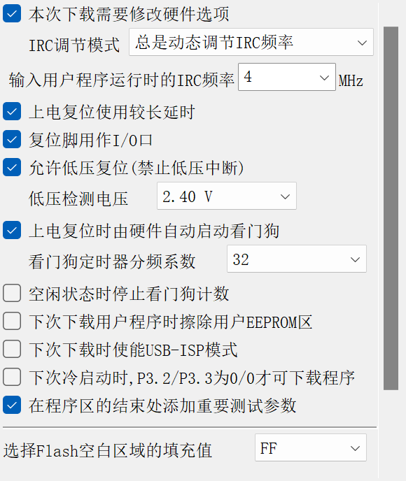
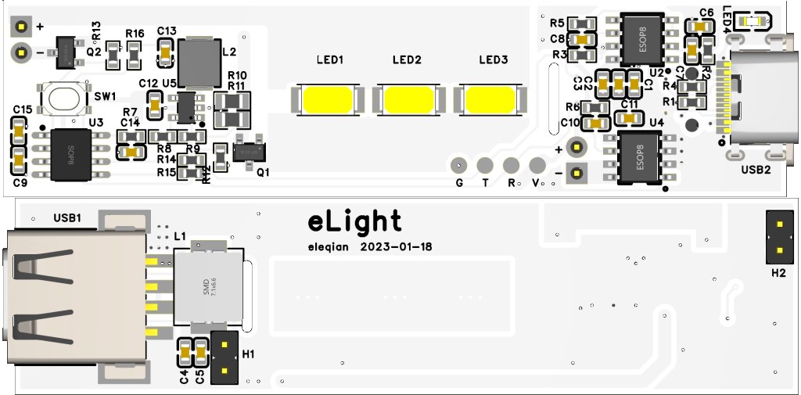
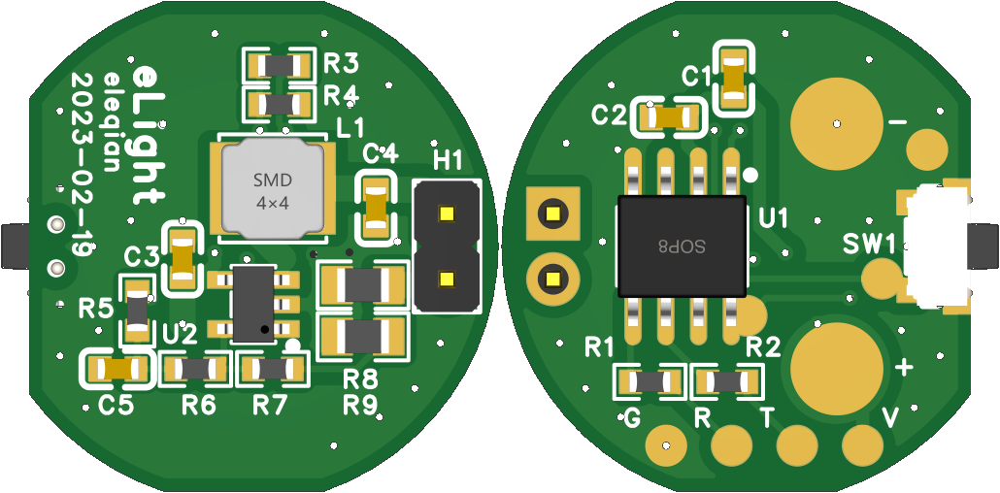
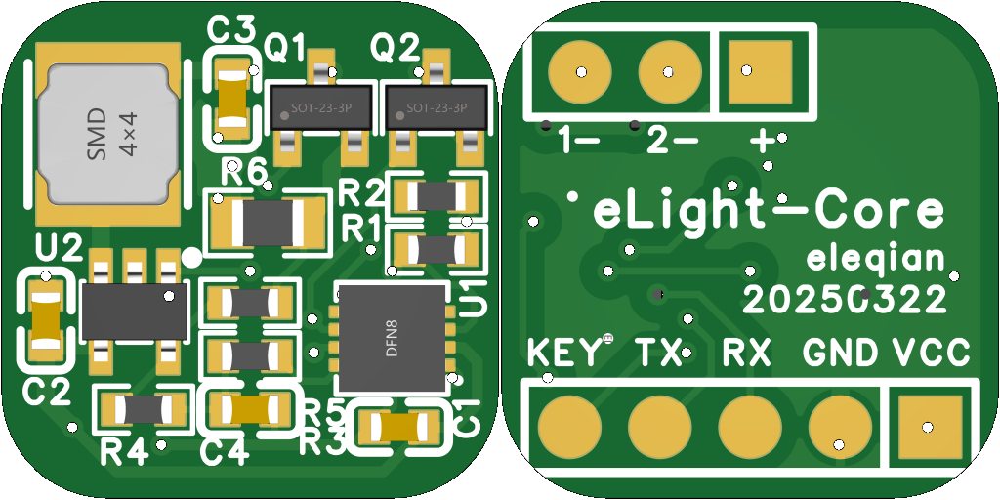
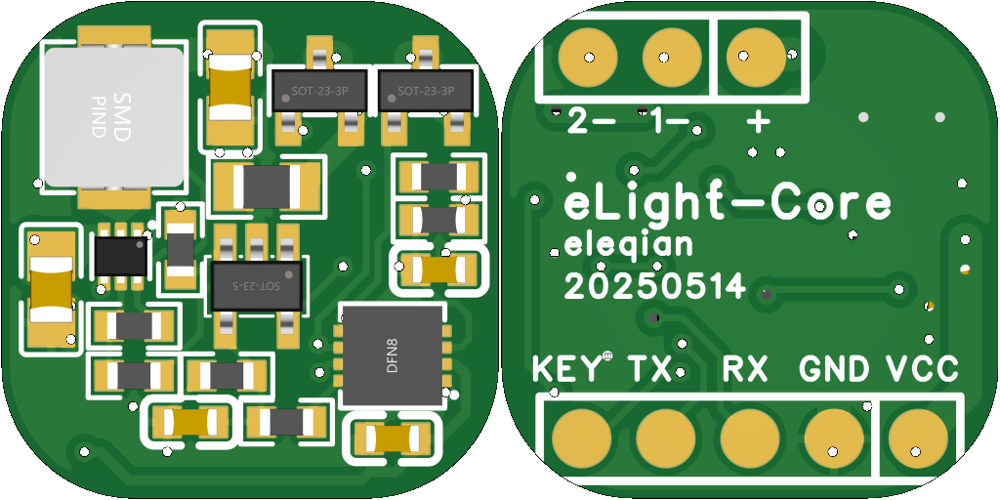
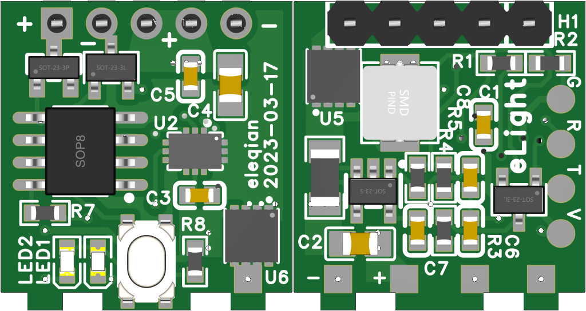

# eLight手电

## 功能
- 支持1/2/3路LED（聚光灯/泛光灯（白+红））分别打开和32级DC调光，无频闪；
- 支持爆闪和SOS模式，闪烁频率分别两档可调；
- 支持低电量自动提醒和关闭，支持手动查看电量；
- 支持NTC温控，温度过高自动降低亮度；
- 支持关闭状态锁定按键，防误触打开；
- 支持看门狗复位和强制复位，避免死机；
- 支持不断电ISP升级（需要引出串口的硬件版本）。

## 单片机
- STC8G1K08A/STC8G1K17A，SOP8/DNF8，10位ADC，最大10位PWM输出，宽电压范围，掉电模式唤醒；
- MCU主频4M(输出8位PWM)/16M(输出10位PWM)，PWM频率约15.6k，gamma矫正后32级亮度。

## 按键操作
- 短按：50～500ms，长按：>500ms（之后每50ms连发），超长按：>8s，连按（2~4次）：相邻两次短按间隔<250ms；
- 关状态：短按打开聚光灯，双击打开泛光灯（双LED版本，单LED时以最大亮度打开），长按查看剩余电量；
- 开状态：短按关，双击调到最大亮度，3击打开对应灯爆闪，长按连续调亮度，每次长按切换调亮暗方向；
- 爆闪状态：短按切换SOS，再短按关，爆闪和SOS固定最大亮度，长按切换频率或间隔；
- 锁定和解锁：连续4击，锁定时按键泛光灯快速闪烁一次；
- 任意状态超长按强制复位。

## 按键状态机
- 每次短按立即处理以提高响应速度，所以连按的每个事件都会处理（短按1~4次的事件），处理依靠状态机设计保证最终状态正确；
- 单LED版：

    | 当前状态/事件  | 单击   | 双击  | 3击   | 4击   | 长按   | 超长按 | 超时  |
    | :---:         | :---: | :---: | :---: | :---: | :---: | :---: | :---: |
    | off           | on    | on,高亮 |   -  |  -    | bat   | 复位 |  -   |
    | on            | off   | on,高亮 | flash |  -   | 调亮度 | 复位 |  -   |
    | flash         | sos   |   -    |   -   | lock  | 调频  | 复位 |  -   |
    | sos           | off   | on,高亮 |  -   |  -    | 调频   | 复位 |  -   |
    | lock          |   -   |   -    |   -   | off   |   -   | 复位 |  -   |
    | bat           |   -   |   -    |   -   |   -   |   -   | 复位 | off  |

- 多LED版：

    | 当前状态/事件  | 单击   | 双击  | 3击   | 4击   | 长按   | 超长按 | 超时  |
    | :---:         | :---: | :---: | :---: | :---: | :---: | :---: | :---: |
    | off           | on,聚光 | on,高亮 |   -  |  -    | bat   | 复位 |  -   |
    | on            | off   | on,泛光 | flash |  -   | 调亮度 | 复位 |  -   |
    | flash         | sos   |   -    |   -   | lock  | 调频  | 复位 |  -   |
    | sos           | off   | on,高亮 |  -   |  -    | 调频   | 复位 |  -   |
    | lock          |   -   |   -    |   -   | off   |   -   | 复位 |  -   |
    | bat           |   -   |   -    |   -   |   -   |   -   | 复位 | off  |

## 状态记忆和复位
- 调整的值自动记忆到RAM，超长按强制复位MCU，同时清除记忆状态。

## 电量提醒和保护
- 长按查看时根据电压估算电池剩余电量百分百，低亮度点亮泛光灯0.01~1.5s后关闭；
- 电压<3.2v为低电量，正常模式每隔10s快速闪烁2次提醒，爆闪和SOS模式不提示；
- 电压<2.9v自动降低亮度，到最低亮度则关闭；
- 电压判断有0.1v滞回，即电压上升时需要到3.4v或3v。

## 低功耗
- 关状态延时2s MCU进掉电模式，按键中断唤醒；
- 开状态不能停PWM时钟，进空闲模式，每0.5s测量电压。

# 固件编译
- 修改config.h中CONFIG_BOARD_TYPE宏为对应硬件（见BOARD_TYPE_xxx宏）；
- 使用MDK C51编译生成eLight.hex。

# 固件下载
- 使用STC-ISP软件下载eLight.hex到单片机，在未连接电池时参考标准STC下载方法；
- 连接电池后可以长按强制复位进入升级，先打开STC-ISP软件点击下载，复位后会进入ISP模式自动开始。
- 对于BOARD_TYPE_PRO硬件类型，单片机时钟频率选择16MHz，其它类型选择4MHz，其他配置参考截图：

# 支持的硬件版本
## LED驱动方案
### 小功率（<3W）
- PAM2804/SY8006/LN2401等开关降压恒流IC，功率<3W，效率>90%，可实现DC调光和PWM调光；
- DC调光由PWM滤波为DC后进FB控制，低亮度时误差大，但电流小光效更高；
    + PWM经1级RC滤波（10k-1uf），再经过200k-10k与电流采样叠加进FB，实现10%～100%恒流；
    + 爆闪模式可以>100%电流实现更高亮度，由于是间歇打开，散热可以满足；（未实现）
    + 需要根据电源电压实时调整PWM占空比，以实现滤波后DC电压恒定；
- PWM调光可实现更低亮度，恒流时不用根据电压调占空比，可选开关EN或MOS；（未实现）
    + 开关EN慢启动时间过长导致频率较低（<1kHz）；
    + 开关MOS打开时有脉冲电流，需要加入us级慢启动，例如使用开漏+上拉驱动。
### 大功率（>3W）
- 大功率无可用集成芯片，采用Buck芯片+电流反馈实现恒流；
    + Buck芯片使用MP2145，可达到10W功率（输出电流>3A），效率>95%；
    + Buck芯片使用ETA3521，可达到5W功率（输出电流>2A），效率>95%；
- 电流反馈使用零温漂运放GS8551，PWM滤波并衰减101倍后与电流采样电压比较，反馈到FB调节;
- 恒流大小与电池电压*PWM占空比为线性关系，由于电池电压变化范围相对较小，无需根据电压进行PWM修正。

## 硬件-双LED充电宝版
- 外壳基于微笑鲨867A手电改造，充电口改为Type-C USB；
- 支持充电宝功能，5V/2A输入和输出，建议使用3000mAh以上18650锂电池;
- 聚光灯单个1w led（增强散热），泛光灯3个0.5w 5730；
- 支持通过Type-C口进行ISP升级（串口连接SBU脚，需转接板）。

## 硬件-单LED温控版
- PCB适配微笑鲨SD-1006手电；
- 单LED，额定1W，最大可达3W（加强散热）；
- 支持NTC温控。

## 硬件-双LED温控通用版
- 通用控制板，体积小，兼容各种手电改装；
- 双LED（聚光+泛光），有不同功率版本，额定1W/5W；
- 支持NTC温控。

1W版本：

5W版本：

## 硬件-大功率三LED温控版
- PCB适配10W直筒18650手电（可直冲可换电池，型号未知），三路LED；
- 聚光灯最大10W（发热大长时间建议<5w，爆闪可以10W），泛光灯白光1.5W、红光0.75w；
- 无极调光最小到2%功率（10位PWM），泛光灯无极调光为白光、爆闪和SOS为红光；
- 支持NTC温控。
- 电池防反接。

